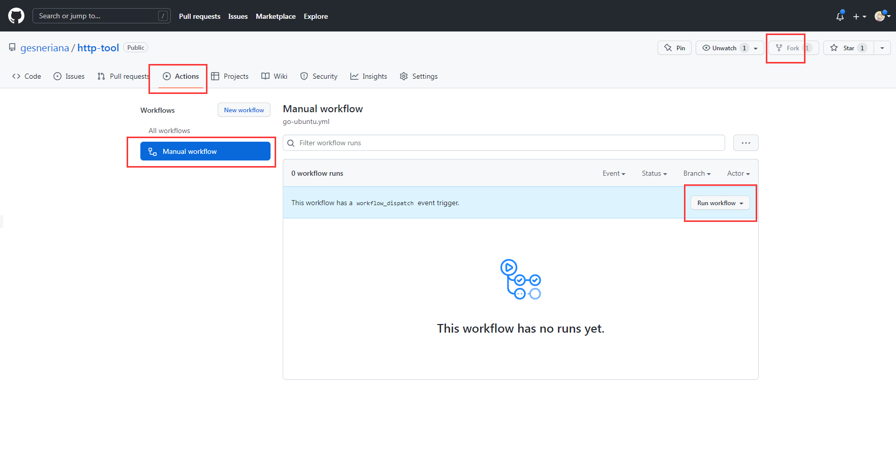
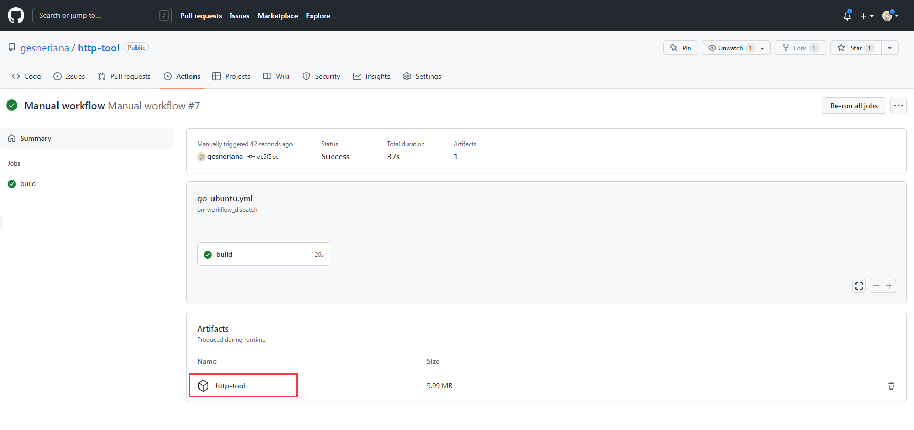
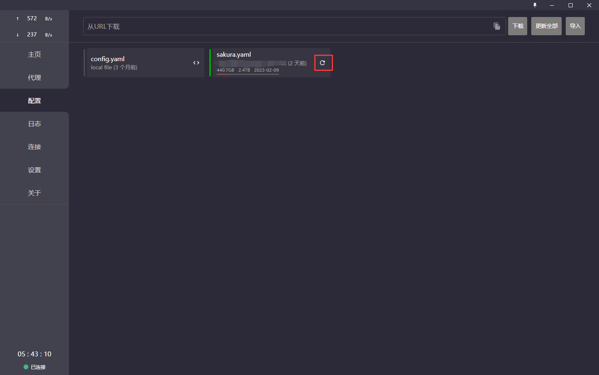
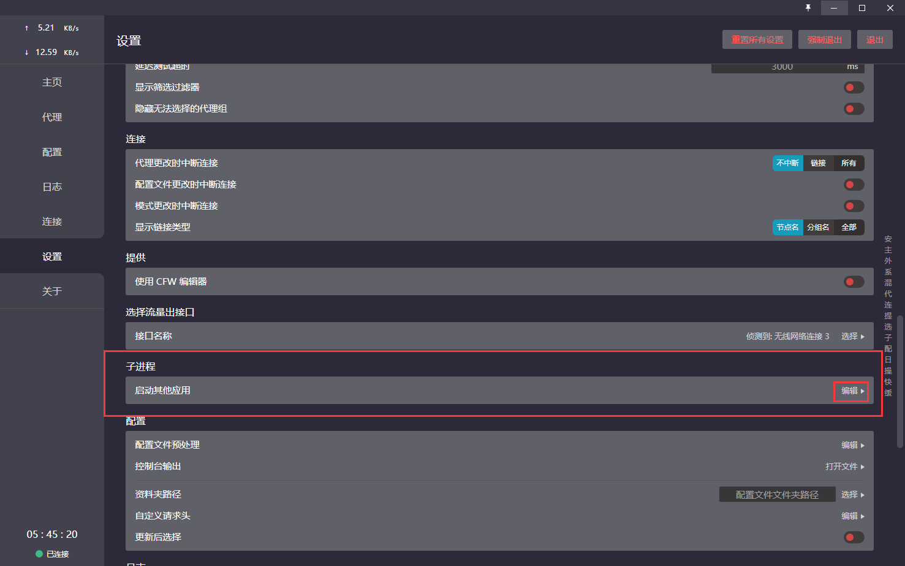
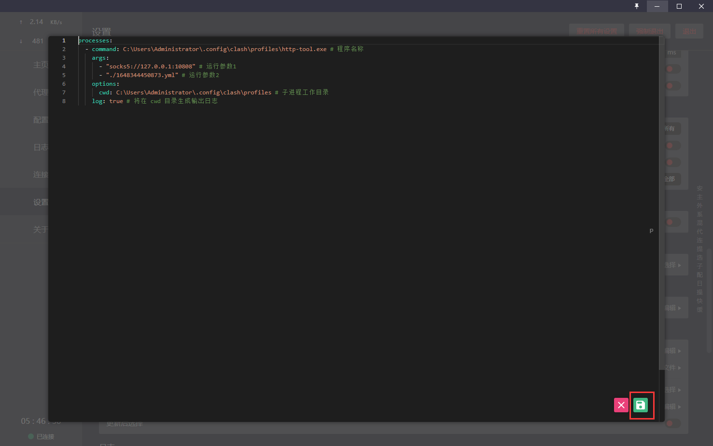
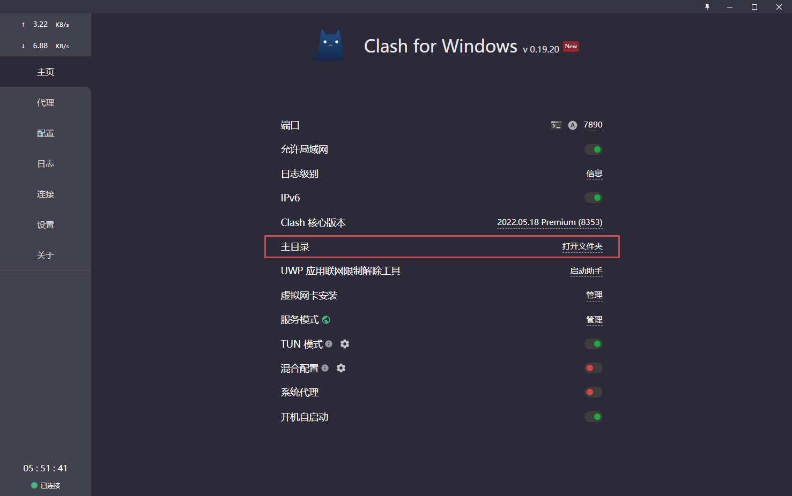
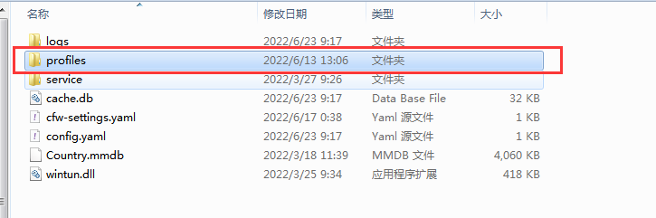
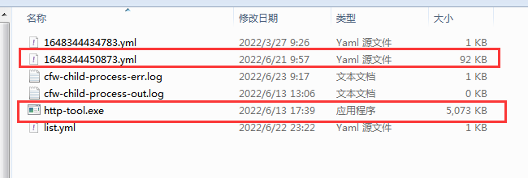
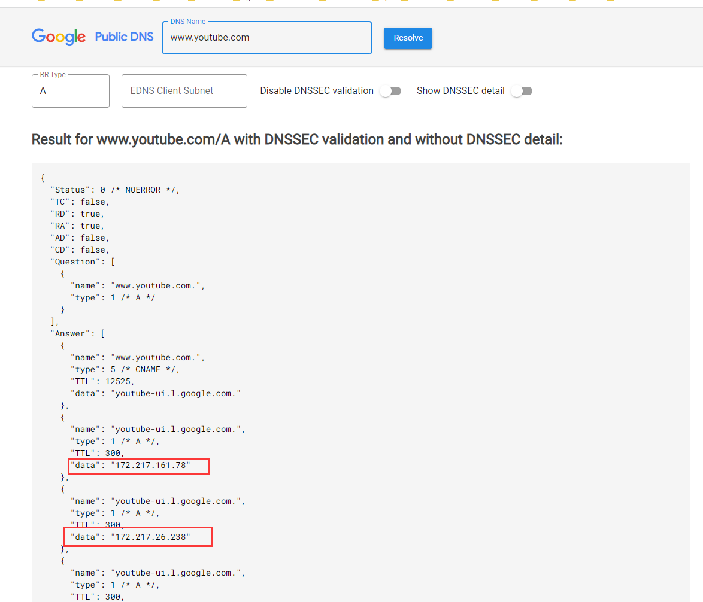

# http-tool

### 这个工具主要是为了解决clash for windows配置文件中国内中转节点域名DNS污染的问题

- 怎么下载
  
  fork这个github仓库, 右上角有个fork按钮, fork之后就可以在自己的仓库中执行工作流

  点开Actions页面, 点击手动执行工作流，点击启动, 无需修改参数，直接点点点就完事了

  

  编译完成后, 这个任务会有显示编译成功，然后就可以下载压缩文件了

  

  不建议使用他人编译的二进制文件, 自己编译比较安全

- 怎么使用
  
  假如你是在windows平台下使用, 最原始的方式就是在命令行中执行，如下所示:

  ./http-tool.exe "socks5://127.0.0.1:10808" "./1648344450873.yml"

  参数说明, "socks5://127.0.0.1:10808" 是v2rayn开启的代理, 不一定非得使用v2rayn

  你也可以使用android手机上的v2rayNG或者SagerNet开启代理, 然后启用局域网共享。

  因为使用到了Google的DNS去解析域名，所以流量必须走代理，否则无法解析

  总之要想正常使用，就得借鸡生蛋，否则无法解决DNS污染的问题，不管你这个socks5代理是哪来的，只要能用就行

  "./1648344450873.yml" 这个就是clash for windows配置文件的相对路径了

  建议把http-tool工具和clash配置文件放在同一个目录中

- 高级用法
  
  在 clash for windows中使用，这里就不介绍cfw怎么使用了，默认你已经是cfw的老用户了。

  更新订阅，如图所示:

  

  

  

  ```
  processes:
  - command: C:\Users\Administrator\.config\clash\profiles\http-tool.exe # 程序名称
    args:
      - "socks5://127.0.0.1:10808" # 运行参数1, 必须。连接Google DNS所使用的代理
      - "./1648344450873.yml" # 运行参数2, 必须。 clash配置文件的相对路径，不建议使用绝对路径
    options:
      cwd: C:\Users\Administrator\.config\clash\profiles # 子进程工作目录，必须
    log: true # 将在 cwd 目录生成输出日志
  ```

  注意：你需要把以上路径改成自己电脑中实际的文件路径

  clash配置文件的路径如图所示：

  

  

  点开 profiles 文件夹

  

  如果你已经按照以上步骤操作好了，重启clash就可以解决DNS污染，如果失败了就打开 cfw-child-process-err.log 看看日志文件的输出内容

  
- 其他说明
  
  如果更新订阅失败了，可能是你的订阅域名被DNS污染了
  
  假设你的订阅域名是 https://www.youtube.com

  打开 https://dns.google/

  输入 www.youtube.com , 不要加上 https:// 前缀否则解析的内容不对

  

  现在得到了想要的ip地址了，接下来就是修改windows系统的hosts文件了

  文件路径是: C:\Windows\System32\drivers\etc\hosts

  追加一行数据: 172.217.161.78  www.youtube.com

  接下来你就可以正常更新订阅了，如果你的订阅服务器是在海外，请开启代理否则也无法访问